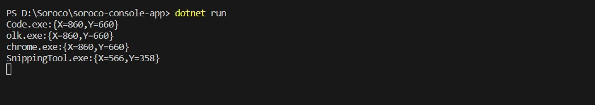

### Prerequisites

- .NET version used for testing the app is - 7.0.304. Make sure that a compatible .NET version is present before running the app.
- Make sure that all the required development tools are present.

### Steps to run the app

1. Clone the app to an empty directory.
2. Run the command "dotnet run" to start the app.
3. On clicking anywhere on the screen the required output will be printed on the console.

### Screenshot

